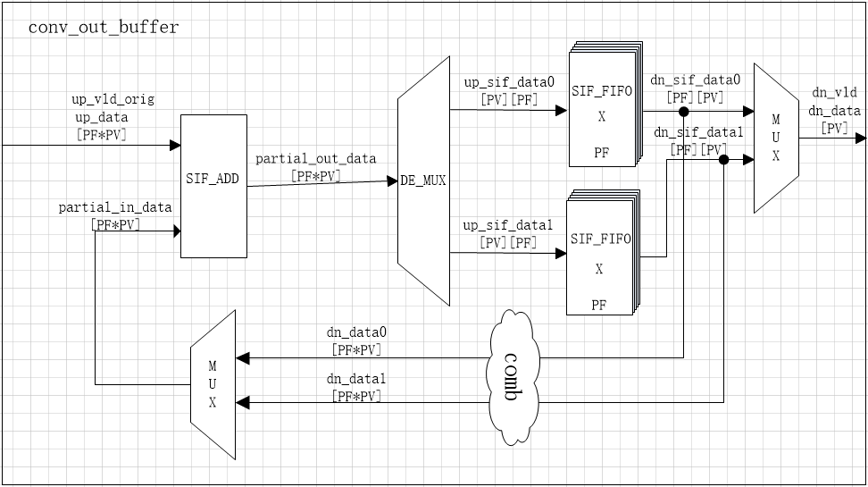

Copyright (c) 2016 Corerain Technologies. All rights reserved.  
No part of this document, either material or conceptual may be 
copied or distributed, transmitted, transcribed, stored in a retrieval 
system or translated into any human or computer language in
any form by any means, electronic, mechanical, manual
or otherwise, or disclosed to third parties without
the express written permission of Corerain Technologies. 
  
# conv_out_buffer设计规格

## 概述
这个模块主要功能是将并行输入的多个filter数据转换为按每个filter依次串行输出，并且对同一个filter下的不同channel的数据进行叠加降维，
累加的过程使用乒乓操作，将同一个filter下的不同channel数据缓存到同一个fifo中,输入的第一个channel数据与零累加，结果存入fifo进行缓存，当第二个channel
数据到来时，读出上述缓存的结果与之进行叠加，后续到来的channel依次与之前累加结果进行累加，最终将同一filter下的所有不同channel的数据叠加并且按不同filter
依次输出。

key | value 
--- | --- 
Top level name : | conv_out_buffer 
Version : |	2.0.0
GitHub Path GitHub : | https://github.com/corerain/rainman/tree/master/engine/conv/hdl
Design Owner : | yanxu.yang@corerain.com
Verification by : | yanxu.yang@corerain.com

如下时conv_out_buffer模块内部结构图。

## 用例

在pf不等于1的时候，kernel_2D输出的时多个filter并行输出的数据，并且是多个channel的数据依次输出，conv后续模块需要对单个filter数据进行添加bias以及bn;
由于bias和bn针对不同的filter有不同的参数值，所以需要一个能够把filter分离开的模块，并且后续模块的输入只支持一个channel的数据，所以也需要能够把channel
在前面模块完成叠加，conv_out_buffer模块就是实现把多个channel数据叠加，并且把不同filter的数据分离开来，分别依次输出。

主要用来把kernel模块输出的多个filter并行的数据分离开，按每个filter串行输出，并且把多个channel的数据叠加为一个channel输出
为后续模块单独对每个filter依次叠加不同的bias准备;

## 输入输出信号

|Name|Signal|Width|Description|
| --- | --- | --- | --- |
| up_vld_orig | input | 1 | 输入数据有效信号 |
| up_data | input | pv*pf*data_width | pf*pv个conv_kernel_2D并行输出的数据|
| up_rdy | output | 1 | conv_out_buffer模块能够接收数据的准备信号 |
| dn_vld | output | 1 | 输出数据的有效信号|
| dn_data | output | pv*data_width | 输出的数据信号，pf个并行kernel数据分别串行输出|

## 内部信号

|Name|Width|Description|
| --- | --- | --- |
| conv_in_bank | 1 | 控制输入不同的filter的数据缓存到不同的两个fifo中 |
| conv_out_bank | 1 | 控制不同filter的数据分别交替输出 |
| final_vld_0 | 1 | 代表第一个filter的所有channel数据接收和叠加完成，开始输出第一个filter的结果 |
| final_vld_1 | 1 | 代表第二个filter的所有channel数据接收和叠加完成，开始输出输第一个filter的结果 |
| final_vld | 1 | 代表两个bank的数据都接受和叠加完成 |
| channel_counter | 1 | 输入数据通道计数 |
| pixel_counter | 1 | 输入的像素点个数 | 
| filter_counter | 1 | 接收filter个数计数 |
| reg_channel_finish | 1 | 标致每个filter所有channel接收完成 |
| obuf_adding_vld | 1 | 不同channel数据叠加的有效使能 |

## 参数

| parameter | defaul | function |
| --- | --- | --- | 
| dma_width  | 32 | dma数据位宽 	  		|
| data_width | 32 | 像素数据位宽	  		|
| k			 | 3  | kernel 位宽 	  		|
| pv  		 | 2  | 像素点传输的并行数据个数|
| pf  		 | 1  | 并行filter的个数		|

## 功能

模块通过加法器采用乒乓操作的方式叠加kernel_2D模块输入的不同channel的像素点，并且将不同filter的运算结果独立缓存到pf个fifo中，当所有channel数据叠加完缓存在缓存区后,
按不同的filter依次分别输出像素点，最终实现不同的filter的数据分离输出;

* 模块有两个缓存区，输入的数据通过conv_in_bank来控制，相同的filter数据缓存在同一个缓存区，当输入多个filter时候，conv_in_bank取0和1，
交替缓存不同filter的数据。
* 接收数据的up_rdy信号必须在final_vld_0和final_vld_1不同时为1的情况下才能有效。
* channel1与channel0进行加法运算时候，缓存channel0的有效使能obuf_adding_vld与输入的up_vld有两个时钟延时，所以输入到模块的channel0和channel1之间至少需要两个时钟间隔。
* 输入到模块的必须是按channel个数依次输入的数据。
* 当channel0数据输入时，与零通过加法器进行累加，累加结果存入缓存区，当channel1输入的数据到来时，读出缓存的channel0的数据并与之累加，累加结果再次存入缓存区，后续channel数据
到来时和上次缓存的累加结果依次进行累加，通过这种乒乓操作，在最后一个channel输入时，与前序channel累加的结果进行最后依次累加，输出最终结果，所以最终结果的输出和输入的数据只有加法器运输的一个时钟的延时。
* 输出数据是按filter个数依次输出的数据。

可验证功能列表：

**FN** feature name 功能名称  
**FD** feature description 功能说明  
**ID** input data 输入数据  
**IS** initial (internal) state 初始（内部）状态  
**CS** control sequence 控制序列  
**FS** finial (internal) state 最终（内部）状态  
**OD** output data 输出数据  
**ES** external status observability 外部状态可观察性 

## 性能

### 带宽
对于pv=8,pf=4,data_width=64,100M时钟情况下，单个channel输入的最大数据带宽为8*4*64*100Mbps=102.4Gbps。
### 延迟
由于模块需要对不同channel数据进行叠加，并且需要把并行filter数据转换成串行filter数据分别输出，所以模块需要所有channel数据叠加完成，才能进行输出，
系统总延迟=一个filter数据总时间+加法器运算延时;
### 启动时间
由于模块使用异步复位，所以模块的启动时间就等于复位时间;
